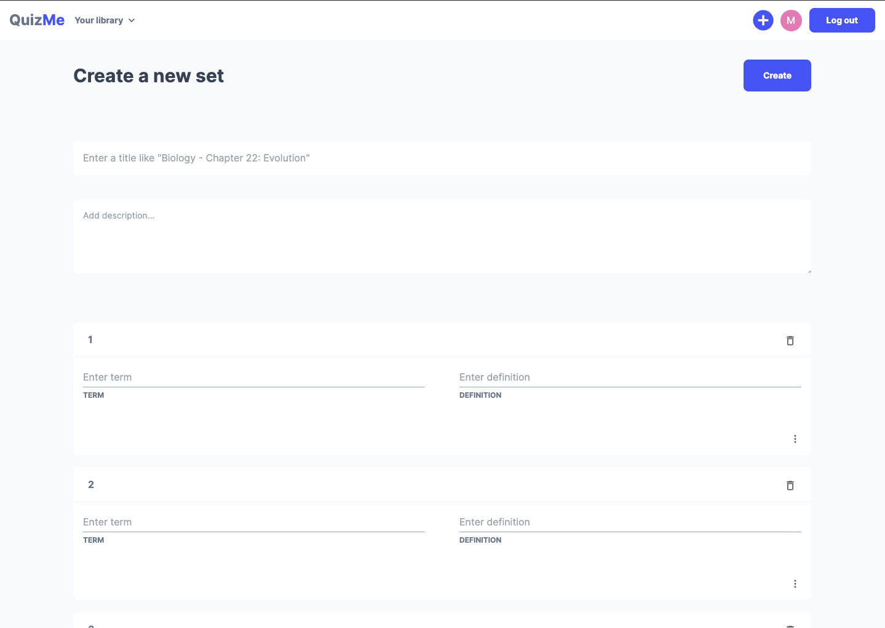
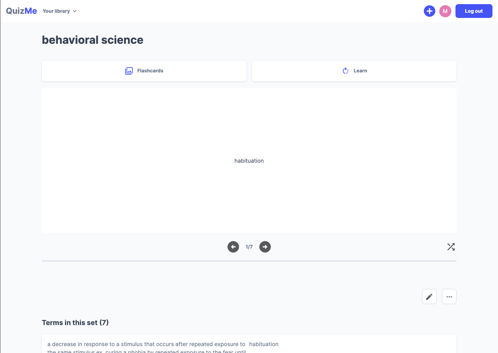
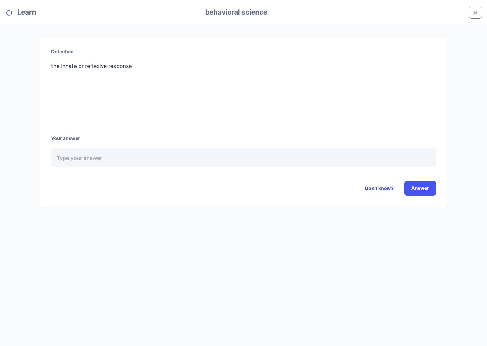

<h1 align="left">QuizMe</h1>

<p align="left">A full stack web app inspired by Quizlet, which provides students a tool for creating and reviewing digital flashcards. Includes "Flashcard" and "Learn" modes.</p>

## Links

- [Repo](https://github.com/mtojong246/quiz-me "QuizMe Repo")

- [Live](https://quiz-me-mtojong246.vercel.app/ "Live View")

## Screenshots







## Get Started

1. Clone the repository 

```Bash
git clone https://github.com/mtojong246/quiz-me.git
```

2. Change the working directory 

```Bash
cd quiz-me
```

3. Add Environment Variable path of this directory

4. Run the app using terminal 

```Bash
npm run dev
```

## Key Features

- Create, edit and delete flaschard sets
- Review flashcard sets in "Flashcard Mode" or "Learn Mode" 
- Organize created sets into folders 
- Make changes to username, email and password in Profile Settings 
- Utilize social sign-in with Google OAuth 


## Built With

- Next.js
- TypeScript
- PostgreSQL
- Prisma
- Supabase
- Tailwind CSS
- Material UI
- NextAuth

## Author

**Melanie Tojong**

- [Github](https://github.com/mtojong246 "Melanie Tojong")
- [Email](mailto:mtojong@gmail.com?subject=Hi "Hi!")
- [Website](https://melanie-tojong.dev "Welcome")

## 🤝 Support

Contributions, issues, and feature requests are welcome!

Give a ⭐️ if you like this project!